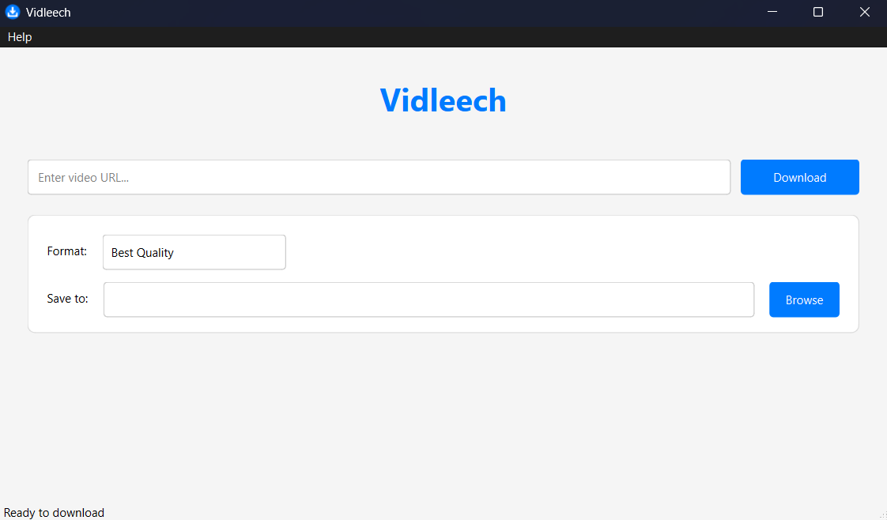

# Vidleech

[](https://github.com/maread2/vidleech/actions/workflows/ci.yml)
[](https://github.com/maread2/vidleech/releases/latest)
[](https://opensource.org/licenses/MIT)
[](https://www.python.org/downloads/)

A modern GUI video downloader powered by yt-dlp.



## Features

- 🎨 Clean, modern GUI interface
- 🎥 Support for multiple video platforms
- 📊 Real-time download progress tracking
- 🔧 Format selection (Best, HD, SD, Audio)
- 📁 Custom download directory
- ⚡ No external dependencies required
- 🚀 Standalone Windows executable

## Installation

### Option 1: Download Executable (Windows)

1. Go to the [Releases](https://github.com/maread2/vidleech/releases) page
2. Download the latest `vidleech.exe`
3. Run the executable

### Option 2: From Source

1. Clone the repository:
```bash
git clone https://github.com/maread2/vidleech.git
cd vidleech
```

2. Install Poetry (if not already installed):
```bash
curl -sSL https://install.python-poetry.org | python3 -
```

3. Install dependencies:
```bash
poetry install
```

4. Run the application:
```bash
poetry run python src/main.py
```

## Usage

1. Launch Vidleech
2. Paste a video URL
3. Select desired format
4. Choose download location
5. Click Download

## Supported Platforms

Vidleech supports downloading from various platforms including:
- YouTube
- Vimeo
- Dailymotion
- And many more...

See the full list of supported sites [here](https://github.com/yt-dlp/yt-dlp/blob/master/supportedsites.md).

## Contributing

We welcome contributions! Please see our [Contributing Guidelines](CONTRIBUTING.md) for details.

1. Fork the repository
2. Create your feature branch
3. Make your changes
4. Submit a pull request

## Development

- Built with Python 3.11 and PyQt6
- Uses Poetry for dependency management
- Follows Black code style
- Includes comprehensive test suite

### Running Tests

```bash
poetry run pytest
```

### Building Executable

```bash
poetry run pyinstaller src/main.py --name=vidleech --onefile --noconsole
```

## Security

For security issues, please see our [Security Policy](SECURITY.md).

## License

This project is licensed under the MIT License - see the [LICENSE](LICENSE) file for details.

## Acknowledgments

- [yt-dlp](https://github.com/yt-dlp/yt-dlp) for the core downloading functionality
- [PyQt6](https://www.riverbankcomputing.com/software/pyqt/) for the GUI framework
